# Como cargarme a una tarea de github
1. Unirse a la tarea
  - Para esto les mando un link como este https://classroom.github.com/a/uYwn9gbX
  - Les va a aparecer una ventana asi las primeras veces
  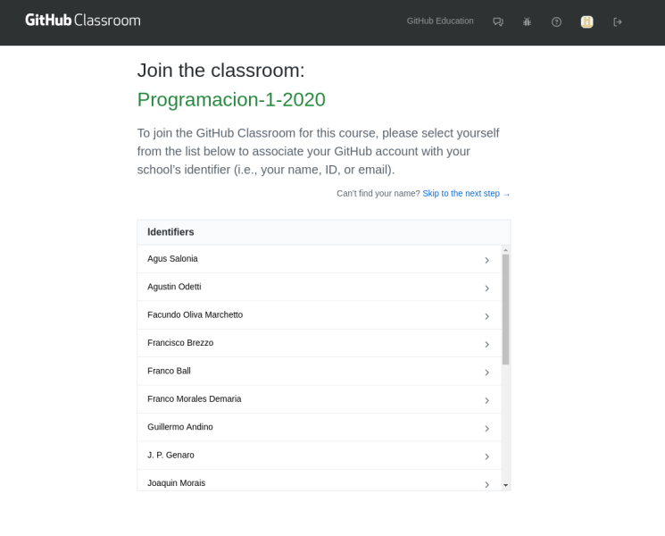
  - Si no se encuentran, tocan skip ahi arriba a la derecha y aceptan el assignment
  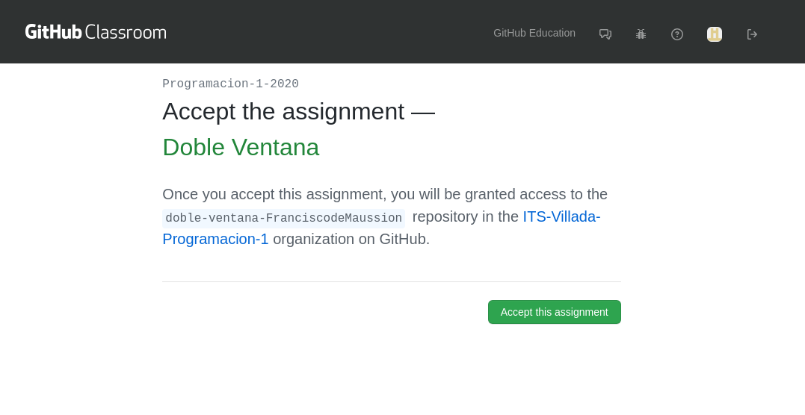
  - Demora un ratito, pero una vez terminado, les aparece asi
  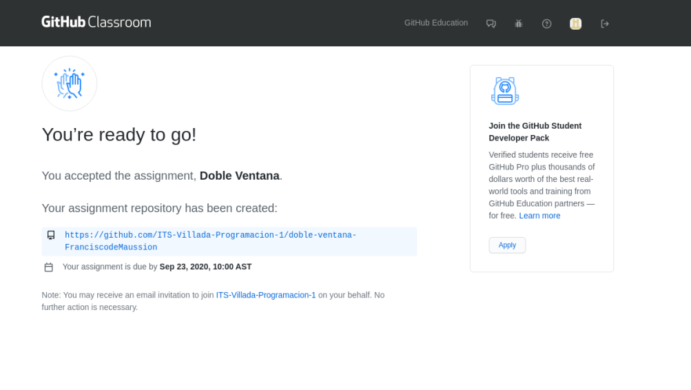
  - Si le dan click al link en azul, los va a mandar a su repo
  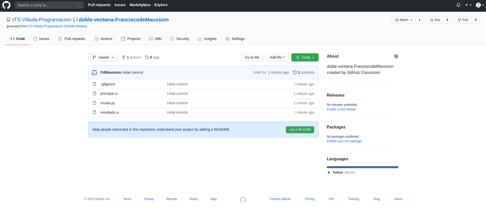
  - Le dan click al boton code(en verde) y les va a aparecer este desplegable, que tienen que tocar el boton para copiar que es el que esta al lado del url
  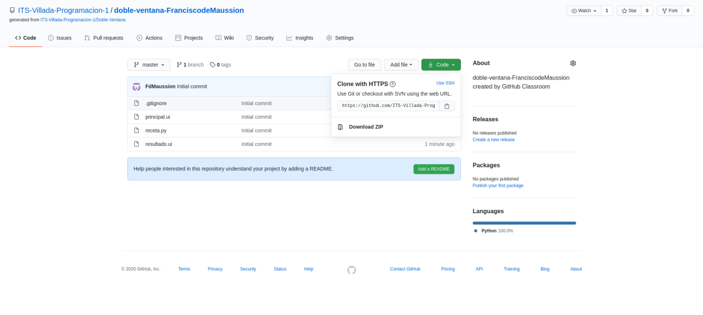

2. Clonar el repo
  - Abrimos una explorador de archivos en un directorio comodo, yo voy usar Documents
  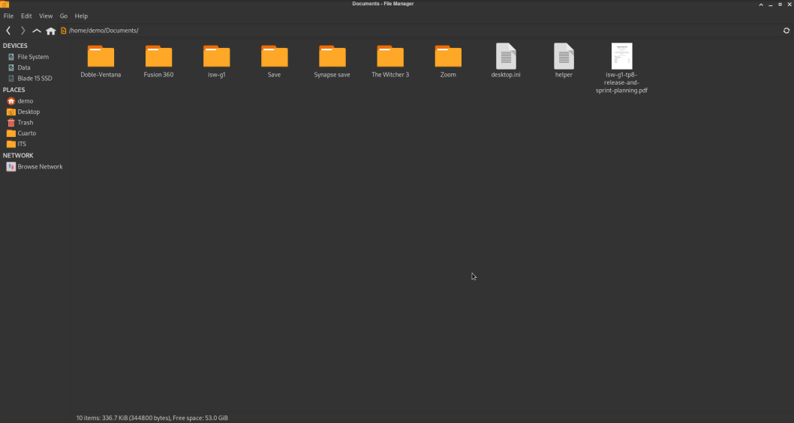
  - Click derecho open a terminal here(abrir terminal aca)
  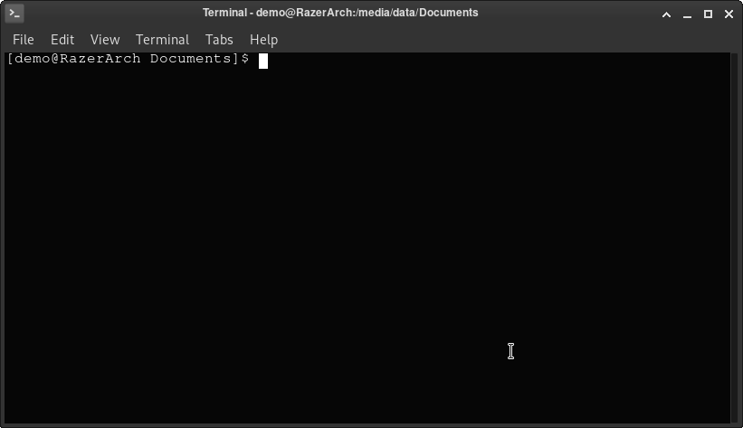
  - Dentro de la terminal ponemos `git clone link-repo`. Si hacen un `ls` deberian ver que se creo una nueva carpeta con los datos del repo
  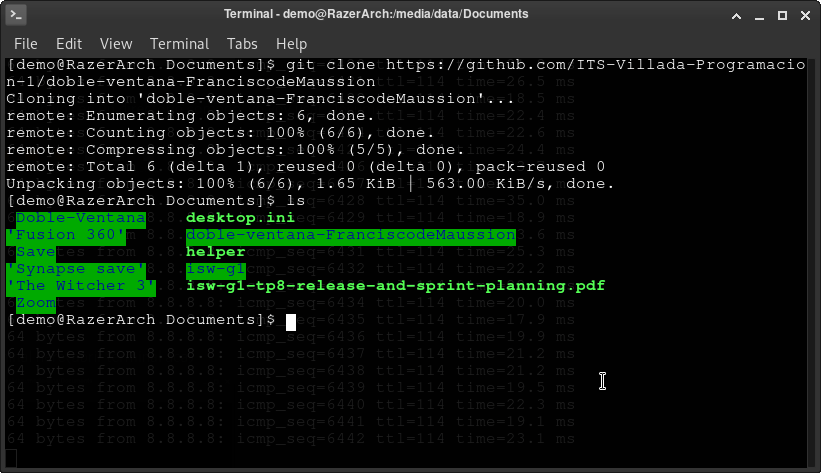
  - `cd directorio-creado-para-la-clonacion`
  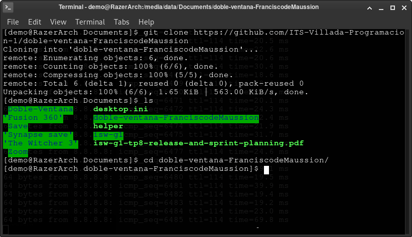
  - Con eso ya estamos listos para empezar a trabajar

3. Realizar modificaciones
  - Lo ideal es que abran esa carpeta con pycharm o su editor de texto. Si nos habiamos olvidado de hacer esto, podemos tirar los archivos ya modificados dentro de esta carpeta

4. Commitear cambios
  - `git status` nos va a decir el estado del repo
  - Si no hay modificaciones
  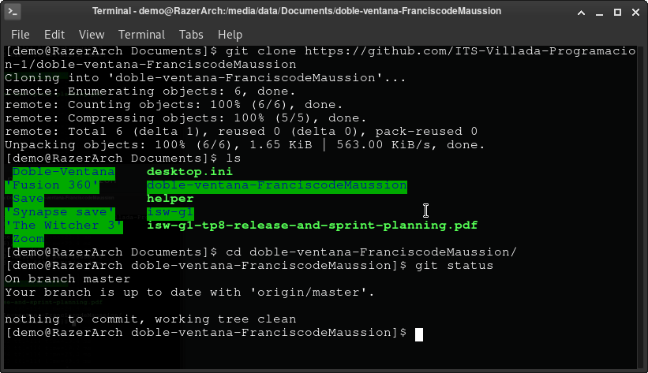
  - O, los cambios que hubo si ls realizaron
  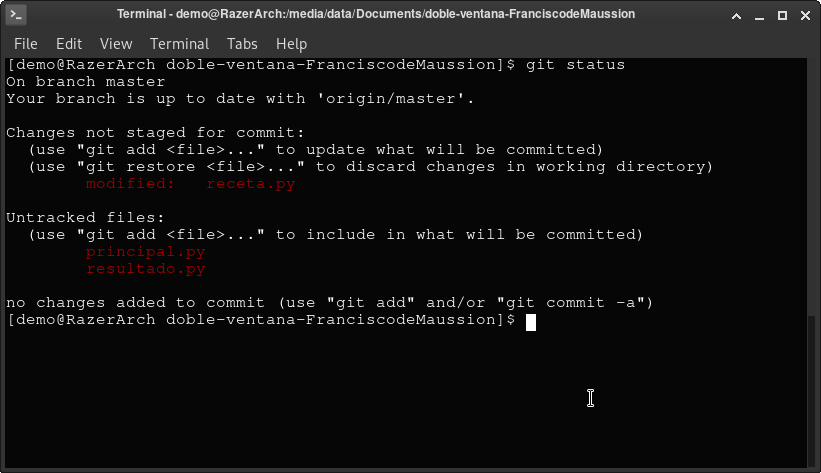
  - `git add .` Se avisan que se cambiaron todos los archivos con modificaciones
  - `git add principal.py` Solo quiero que tomes los cambios de principal.py
  - Y por ultimo quiero guardar esos cambios en la repo local `git commit -m "Mensaje del commit"`
  - Que tengo que poner en el mensaje?  Info util, que hice o que modifique
  - Asi yo puse "Agrego .py convertidos de .ui"
  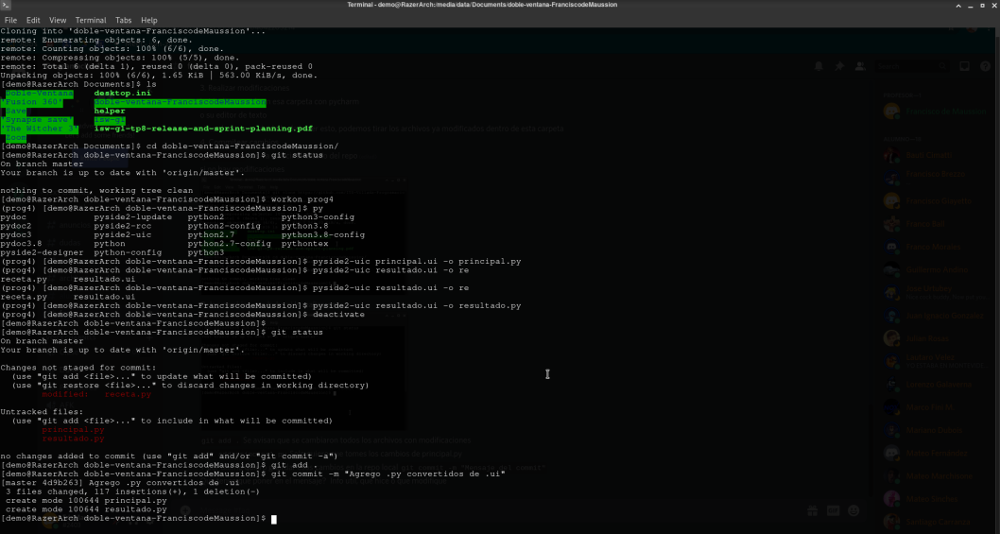

5. Enviar los cambios al remoto
  - `git push` Nos va a pedir usuario y contraseña
  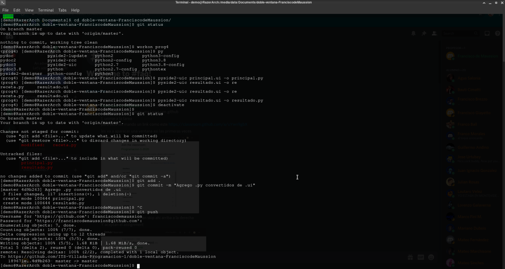
  - Si todo salio bien, cuando hagamos `git status` de nuevo, va a decir que esta todo actualizado
